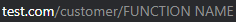
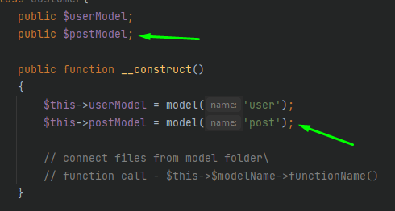

# PHP MVC

<font color="asdadcvsrotkd-fgv">This is easy example of PHP MVC</font>

### <font color="jlsadakdssanda">MENU</font>

[create main page](#create-main-page)

[connect to sql database](#connect-to-sql-database)

[create a next](#create-new-page)

[create a function](#create-a-function-and-call)


### Connect to SQL database

>to connect to the base you need to go to <font color="green"> core/model.php </font>
```php
public function __construct()
{
    $this->conn = new mysqli(/*hostname*/'',/*name*/'',/*pass*/'',/*database*/'');
    $this->query = [
        'limit' => '',
        'where' => '',
        'order' => '',
        'select' => '',
    ];
}
``` 


### Create new page

>to create a new page you have to create a new php </font> folder css file <font color="gree"> *Where should only be a content* </font> file in the 'view' folder 


- in file <font color="green"> controller/customer </font> create a new function and function name this will be the page url name and in function type this code
```php
public function functionName()
{
    view('php content file name', []);
}
```


- to create a css file you need to create file in <font color="green"> css </font> folder css file <font color="red"> *content file name and css file name must match* </font>


### Create a function and call

>to create a function go to class where new function will be created <font color="gree"> classes are in the model folder </font>

- main functions in the <font color="green"> core/model.php </font> file

> for function call go to <font color="green"> controller/customer </font> file and in created function call this function
>> to connect the model class to customer create a public variable and  create a new object
> in name set sql table name


>to call function write
```php 
$this->$modelName->functionName();
```


### Create main page

>to create main page go to main <font color="green"> index.php </font> file and in variable **$main_page** set a main page URL
> 
>


###
###### Author - Mher Barseghyan

